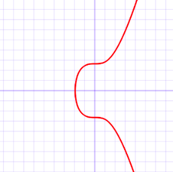

# 1wallet

一个用于**教学目的**的**多签钱包**项目，具有以下特性：

* 采用了一流的web3框架[Foundry](https://github.com/foundry-rs/foundry)，使用TDD模式开发，编写了详尽的单元测试 / 模糊测试和适当的注释
* 涵盖了 链上签名验证、 [ERC20](https://eips.ethereum.org/EIPS/eip-20), [ERC721](https://eips.ethereum.org/EIPS/eip-721), [ERC165](https://eips.ethereum.org/EIPS/eip-165), [ERC712](https://eips.ethereum.org/EIPS/eip-712), [ERC2162](https://eips.ethereum.org/EIPS/eip-2612) 等常用技术，能够保管并根据用户的要求转移Ether、ERC20 token和ERC721 token (NFT)

### 使用说明

1. [安装Foundry](https://book.getfoundry.sh/getting-started/installation.html)
2. `forge install Rari-Capital/solmate openzeppelin/openzeppelin-contracts` 安装solmate和openzeppelin合约开发库
3. `forge test` 在本地进行测试
4. 参照[Foundry book](https://book.getfoundry.sh/tutorials/solidity-scripting.html), `forge script script/Deploy.s.sol:MyScript --rpc-url $RINKEBY_RPC_URL  --private-key $PRIVATE_KEY --broadcast --verify --etherscan-api-key $ETHERSCAN_KEY -vvvv` 在Rinnkeby测试网部署Router合约并验证代码
5. 与Router合约的`createWallet`方法交互以创建钱包，后续除设置新的多签人数和设置信任地址需要与Router合约交互，取款相关的操作均直接与钱包合约交互。

```ml
.
├── script
│   └── Deploy.s.sol --向以太坊网络部署合约的Solidity script, Foundry only
├── src
│   ├── 1walletRouter.sol --用户在创建钱包,设置信任地址,修改多签人数时直接交互的合约
│   ├── 1wallet.sol --钱包主合约
│   └── Mock
│       ├── MockERC20.sol --测试时使用的MockERC20合约
│       └── MockERC721.sol --测试时用的MockERC721合约
└── test
    ├── 1walletRouter.t.sol --Router的测试合约
    ├── execution_erc20.t.sol --ERC20 token 提款功能的测试合约
    ├── execution_erc721.t.sol --ERC721 token取出功能的测试合约
    ├── execution_ether.t.sol --Ether 提款功能的测试合约
    ├── setQuorum.t.sol --设置新多签人数的测试合约
    ├── setTrustedAddress.t.sol --设置信任地址功能的测试合约
    └── unit.sol --模拟用户链下签名的工具合约，供给上述合约使用
```

---

## **关键概念理解(新手向)**

### **1. 签名, 验证, EIP712**
#### **签名**:
以太坊通过对原始消息进行签名，矿工在执行交易前需要对签名进行验证以确定真伪。

某个原始交易可能是这样的：
```json
{
  "id": 2,
  "jsonrpc": "2.0",
  "method": "account_signTransaction",
  "params": [
    {
      "from": "0x1923f626bb8dc025849e00f99c25fe2b2f7fb0db",
      "gas": "0x55555",
      "maxFeePerGas": "0x1234",
      "maxPriorityFeePerGas": "0x1234",
      "input": "0xa0712d6800000000000000000000000000000000000000000000000000000000000000fa",
      "nonce": "0x0",
      "to": "0x07a565b7ed7d7a678680a4c162885bedbb695fe0",
      "value": "0x1234"
    }
  ]
}
```
input不为空，这是个EOA→合约帐户的交易。在单纯转账的情况下input是空的，因为“from”、“to”和“value”字段已经确定了这笔交易的发起方、接收方、金额大小。  
明确几个概念，数字签名算法DSA（ Digital Signature Algorithm ）, 椭圆曲线算法ECC，而ECDSA是ECC与DSA的结合，被称为椭圆曲线数字签名算法。整个签名过程与DSA类似，所不一样的是签名中采取的算法为ECC。所以被称为ECDSA。
<div style="text-align: center">

</div>  
以太坊使用的secp256k1是指ECDSA(椭圆曲线数字签名算法)曲线的参数。ECDSA 执行签名操作之后得到的签名由两个数字（整数）组成：r 和 s。以太坊还引入了额外的参数v(恢复标识符),则最终签名可以表示成 {r, s, v}。

在创建签名时，要先准备好一条待签署的原始消息(交易)，和用来签署该消息的私钥(d)。

**这意味着只有EOA有能力进行签名，因为合约帐户没有私钥。**

简化的签名步骤即使用 私钥+ECDSA算法对原始消息的哈希进行密码学运算最终得到r，s，v。在solidity层面，这三个签名数据的类型是uint256,uint256,uint8.  
也就是说{r, s, v} 签名可以组成一个长达 65 字节的序列：r 有 32 个字节，s 有 32 个字节，v 有一个字节。

>在以太坊上，通常使用 `Keccak256("\x19Ethereum Signed Message:\n32" + Keccak256(message))`来计算哈希值。这样，在计算过程中由于引入了明确的和以太坊相关的字符，正常情况下可以确保该签名不能在以太坊之外使用。  
>其实原始的表达形式是 `Keccak256("\x19Ethereum Signed Message:\n" +length(message) + message)` ,但被Hash过的message长度为固定的32字节，因此就变成了：`Keccak256("\x19Ethereum Signed Message:\n32" + Keccak256(message))` 

如果我们将该签名编码成一个十六进制的字符串，我们最后会得到一个 130 个字符长的字符串( 65bytes=130个hex字符)。大多数钱包和界面都会使用这个字符串。一个完整的签名示例如下图所示：
```json
{
	"address": "0x76e01859d6cf4a8637350bdb81e3cef71e29b7c2",
	"msg": "原始交易消息",
	"sig": "0x21fbf0696d5e0aa2ef41a2b4ffb623bcaf070461d61cf7251c74161f82fec3a4370854bc0a34b3ab487c1bc021cd318c734c51ae29374f2beb0e6f2dd49b4bf41c",
	"version": "2"
}
```
#### **验证**:
正如上述示例所示，用户发起一笔交易，需要给矿工提供：
1. 原始消息(交易)
2. 签署该消息的私钥对应的地址
3. {r, s, v} 签名本身

验证过程其实就是从**签名+原始消息中恢复出一个地址**，该地址如果等于消息中附带的地址，则表明该交易确实是由该地址签署的，验证通过。否则验证失败。
#### **EIP712**:
EIP712全称`Ethereum typed structured data hashing and signing`,它描述了如何一般性地构建一个函数的签名，该标准使得前端能够对签名有更好的显示，不再只是含混地显示一个16进制的签名(非专业用户很难从头构建得到签名并和前端进行比对以确认他们执行的签名确实是自己期望所期望执行的)，而是更加清晰地向用户展示了它们所签的内容。同时该项技术能够使链下签名更有用，在该多签钱包项目中有体现。  
**EIP712有几个需要深刻理解的核心点：**
1. `DOMAIN_SEPARATOR`  
    `DOMAIN_SEPARATOR`只是一个哈希值，但是可以用来独一无二地标识一个合约。为了完成该目的，它的计算过程一定引入了相关的信息。
    ```solidity
    function calculateDomainSeparator() view internal returns(bytes32) {
        return keccak256(
                abi.encode(
                    keccak256(
                        'EIP712Domain(string name,string version,uint256 chainId,address verifyingContract)'
                    ),
                    keccak256(bytes(name)),
                    keccak256(bytes('1')),
                    block.chainid,
                    address(this)
                )
            );
    }
    ```
    其中最关键的是`block.chainid`和`address(this)`。`block.chainid`引入的信息使得不同链的签名无法互换使用。`address(this)`引入的的信息使得同一条链上不同合约之间的签名无法互换使用。由此计算出来的`Domain Separator`就可以在整个区块链网络(不同的链)中唯一地标识某个合约。solmate在`ERC20`中perimit的实现甚至每次都检查chianid是否被改变了，以防止分叉链或fork网络的情况。  
    btw，`chainid`是合约级别即链上级别的，在客户端级别的叫做`NetworkId`，是客户端用来识别不同网络的机制。
    
2. `PERMIT_TYPEHASH ` 
    `PERMIT_TYPEHASH`清晰地标明了签名是针对哪个函数进行的，如果签名的函数和期望执行的函数不是同一个函数就会导致revert。比如在本项目中，用户希望从钱包中提款ERC20 token，并通过unit工具中的executionERC20Sign对相关参数进行了签名，但是最终误拿这个签名去调了wallet中的executeEther，就会导致执行失败。
3. `nonces variable`
   类似于以太坊帐户中的nonce，在此处用来防止某个签名被重复执行。  
通过上述机制，链下的计算在链上进行验证，最终能够保证：
* 不同链(chainid不同)的签名不能混用
* 同链的不同合约的签名不能混用
* 同合约中不同函数的签名不能混用
* 同函数的签名不能被执行第二次
* 有误的签名不能被执行

### **2. ERC2612**
ERC2612描述了ERC712的一个实际用例，使得ERC20中的permit函数能够完成和approve函数完全一样的功能，但用户可以无需付出任何gas费。原因是对permit调用的签名是链下完成的，并可以无需防范泄漏地、通过任何方式发送给服务提供方，由它执行permit以完成approve操作。具体可以查看solmate的[实现](https://github.com/Rari-Capital/solmate/blob/main/src/tokens/ERC20.sol#L112)和[这篇文章](https://learnblockchain.cn/article/1496)。因此只要服务方乐意，从授权到转钱走整个过程都不需要用户付出任何gas。

### **3. 多签钱包工作原理**
多签钱包有一些民主的意味，只有在不少于设定值的用户数同意时才能够对钱包里的资金进行操作，在某些场景下(比如保管团队资金，家族资金)显然比所谓的单签钱包要靠谱。  
从技术流程上讲，每个多签钱包在创建的时候都有一个初始的信任地址列表和多签人数值，比如某钱包在创建时，信任地址列表中有5个地址，多签人数值设定为3,之后对该钱包的任何操作都至少要经过3个信任地址的签名才能进行。类似地，多签地址列表和多签人数都能够通过此步骤进行更新。
### **4. ERC165与ERC721**
为了使得多签钱包能够接收NFT,必须钱包必须正确实现ERC721TokenReceiver接口：
```solidity
interface ERC721TokenReceiver {
    function onERC721Received(address _operator, address _from, uint256 _tokenId, bytes _data) external returns(bytes4);
}
```
拓展到编程语言的世界中去，无论是Java的interface，还是Rust的Trait(当然solidity中和trait更像的是library)，只要是和接口沾边的，都在透露着一种这样的意味：接口是某些行为的集合(在solidity中更甚，接口完全等价于函数选择器的集合)，某个类型只要实现了某个接口，就表明该类型拥有这样的一种功能。因此，只要某个contract类型实现了上述的`ERC721TokenReceiver`接口(更具体而言就是实现了`onERC721Received`这个函数),该contract类型对外表明自己拥有管理NFT的能力。当然操作NFT的逻辑被实现在该合约其他的函数中。
ERC721标准在执行safeTransferFrom的时候会检查目标合约是否实现了`onERC721Received`函数,这是一种利用ERC165思想进行的操作。  
**那究竟什么是ERC165呢?**  
ERC165是一种对外表明自己实现了哪些接口的技术标准。就像上面所说的，实现了一个接口就表明合约拥有种特殊能力。有一些合约与其他合约交互时，期望目标合约拥有某些功能，那么合约之间就能够通过ERC165标准对对方进行查寻以检查对方是否拥有相应的能力。  
以ERC721合约为例，当外部对某个合约进行检查其是否是ERC721时，[怎么做？](https://eips.ethereum.org/EIPS/eip-165#how-to-detect-if-a-contract-implements-erc-165) 。按照这个说法，检查步骤因该是首先检查该合约是否实现了ERC165, 再检查该合约实现的其他特定接口。此时该特定接口是IERC721. IERC721的基本接口是(为什么说基本，是因为还有其他的诸如`ERC721Metadata` `ERC721Enumerable` 这样的拓展)：

```solidity
pragma solidity ^0.4.20;
/// 注意这个**0x80ac58cd**
///  **⚠⚠⚠ Note: the ERC-165 identifier for this interface is 0x80ac58cd. ⚠⚠⚠**
interface ERC721 /* is ERC165 */ {
    event Transfer(address indexed _from, address indexed _to, uint256 indexed _tokenId);

    event Approval(address indexed _owner, address indexed _approved, uint256 indexed _tokenId);

    event ApprovalForAll(address indexed _owner, address indexed _operator, bool _approved);

    function balanceOf(address _owner) external view returns (uint256);

    function ownerOf(uint256 _tokenId) external view returns (address);

    function safeTransferFrom(address _from, address _to, uint256 _tokenId, bytes data) external payable;

    function safeTransferFrom(address _from, address _to, uint256 _tokenId) external payable;

    function transferFrom(address _from, address _to, uint256 _tokenId) external payable;

    function approve(address _approved, uint256 _tokenId) external payable;

    function setApprovalForAll(address _operator, bool _approved) external;

    function getApproved(uint256 _tokenId) external view returns (address);

    function isApprovedForAll(address _owner, address _operator) external view returns (bool);
}
```
**0x80ac58cd**=
`bytes4(keccak256(ERC721.Transfer.selector) ^ keccak256(ERC721.Approval.selector) ^ ··· ^keccak256(ERC721.isApprovedForAll.selector))`

那么，类似的，能够计算出ERC165本身的接口(它的接口里只有一个**`function** supportsInterface(**bytes4** interfaceID) **external** **view** **returns** (**bool**);` 函数，对其进行`bytes4(keccak256(supportsInterface.selector))` 得到**0x01ffc9a7**)

然后ERC721还定义了一些拓展接口，比如`ERC721Metadata` ，长这样：

```solidity
///  Note: the ERC-165 identifier for this interface is 0x5b5e139f.
interface ERC721Metadata /* is ERC721 */ {
    function name() external view returns (string _name);
    function symbol() external view returns (string _symbol);
    function tokenURI(uint256 _tokenId) external view returns (string); // 这个很重要，前端展示的小图片的链接都是这个函数返回的
}
```

这个**0x5b5e139f** 的计算就是:

```solidity
bytes4(keccak256(ERC721Metadata.name.selector)^keccak256(ERC721Metadata.symbol.selector)^keccak256(ERC721Metadata.tokenURI.selector))
```

solamte实现的ERC721.sol是怎么完成这些ERC165要求的特性的呢？

```solidity
function supportsInterface(bytes4 interfaceId) public view virtual returns (bool) {
        return
            interfaceId == 0x01ffc9a7 || // ERC165 Interface ID for ERC165
            interfaceId == 0x80ac58cd || // ERC165 Interface ID for ERC721
            interfaceId == 0x5b5e139f; // ERC165 Interface ID for ERC721Metadata
}
```

没错就这么简单。当外界按照[link1](https://eips.ethereum.org/EIPS/eip-165#how-to-detect-if-a-contract-implements-erc-165) 的步骤去做检查的时候，如果外界想检查这个合约是否实现了165,好说，就是supportsInterface函数在入参是`0x01ffc9a7`时必须返回true，在入参是`0xffffffff`时，返回值必须是false。上述实现完美达成要求。

当外界想检查这个合约是否是ERC721的时候，好说，入参是**0x80ac58cd** 的时候表明外界想做这个检查。返回true。

当外界想检查这个合约是否实现ERC721的拓展ERC721Metadata接口时，入参是0x5b5e139f。好说，返回了true。

并且由于该函数是virtual的。因此该合约的使用者可以继承该合约，然后继续实现`ERC721Enumerable` 接口。实现完里面的什么`totalSupply` 啊之类的函数之后，把继承的`supportsInterface`重实现为

```solidity
function supportsInterface(bytes4 interfaceId) public view virtual returns (bool) {
        return
            interfaceId == 0x01ffc9a7 || // ERC165 Interface ID for ERC165
            interfaceId == 0x80ac58cd || // ERC165 Interface ID for ERC721
            interfaceId == 0x5b5e139f || // ERC165 Interface ID for ERC721Metadata
						interfaceId == 0x780e9d63;   // ERC165 Interface ID for ERC721Enumerable
}
```

**优雅，简洁，可拓展性拉满。**


